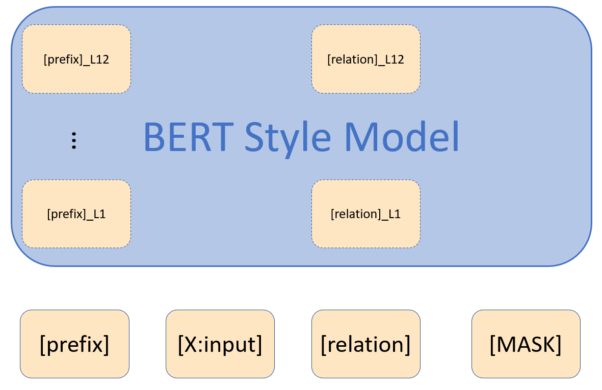

# SimCSE_PRO
This repo contains code for my undergrad thesis.
## Table of Contents
- [SimCSE_PRO](#simcse_pro)
  - [Table of Contents](#table-of-contents)
  - [Main Points](#main-points)
    - [Dynamic Difficulty](#dynamic-difficulty)
      - [Formula](#formula)
      - [Illustration](#illustration)
      - [Details](#details)
    - [Soft Prompts](#soft-prompts)
      - [Illustration](#illustration-1)
    - [Self-Weighted Sentence Embedding](#self-weighted-sentence-embedding)
      - [Illustration](#illustration-2)
  - [Experiment Results](#experiment-results)
    - [Dynamic Difficulty](#dynamic-difficulty-1)
    - [Soft Prompts](#soft-prompts-1)
    - [Self-Weighted Sentence Embedding](#self-weighted-sentence-embedding-1)
      - [Ablation](#ablation)
      - [Explicability](#explicability)
    - [Combining Methods](#combining-methods)
  - [Implementation Details](#implementation-details)
  - [SimCSE: Simple Contrastive Learning of Sentence Embeddings](#simcse-simple-contrastive-learning-of-sentence-embeddings)
  - [Quick Links](#quick-links)
  - [Overview](#overview)
  - [Model List](#model-list)
    - [Reproduction Results](#reproduction-results)
  - [Running the Code](#running-the-code)
    - [Download Datasets](#download-datasets)
    - [Requirements](#requirements)
    - [Training](#training)
    - [Evaluation](#evaluation)
  - [Citation](#citation)
 
## Main Points
- Introduced `Dynamic Difficulty`
- Incorporated `Soft Prompts`
- Explored `Discrete Optimization` through `Gumbel Softmax`
  - Separate repo [here](https://github.com/PKU-TANGENT/Gumbel_Softmax_Sentence_Embedding)
- Devised `Self-Weighted Sentence Embedding`
### Dynamic Difficulty
#### Formula
$
    \hat{\boldsymbol{h}}_i^- = \begin{cases}
    \boldsymbol{h}_i^-& d^-\leq{d^+}\\
    \boldsymbol{h}_i + \lambda (\boldsymbol{h}_i^{-}-\boldsymbol{h}_i)& d^->d^+\\
    d^- = \lVert\boldsymbol{h}_i^{-}-\boldsymbol{h}_i\rVert\\
    d^+ = \lVert\boldsymbol{h}_i^{+}-\boldsymbol{h}_i\rVert\\
    \end{cases}
$

$    \begin{cases}
    \lambda = (\frac{d^+}{d^-})^{\zeta\cdot p_{avg}^{+}}& \zeta \in (0,1)\\
    p_{avg}^{+} = \frac{1}{100}\sum_{j\in[-100,-1]}{\exp (-\mathcal{L}^{j})}
    \end{cases}$

Notes: $p_{avg}^{+}$ maintains *average accuracy* for correctly classifying *positive instances* over the last 100 steps.
#### Illustration
<!--  -->


#### Details
Inspired by 2021 ICLR paper *[On Learning Universal Representations Across Languages](https://openreview.net/forum?id=Uu1Nw-eeTxJ)*.

Intuition: move negative sample closer to input, according to previous training losses.
### Soft Prompts
- [Prefix-Tuning](https://arxiv.org/abs/2101.00190) style soft prompts (backbone frozen)
- Output of [MASK] as representation, inspired by [PromptBert](https://arxiv.org/abs/2201.04337)
- Two set of parameters for soft prompts (Dual Prompt)
  - For constructing positive instances
#### Illustration
<!--  -->


### Self-Weighted Sentence Embedding
This is a degenerated version of the `Gumbel Softmax` style optimization that I envisioned. Applying `Gumbel Softmax` to a token is equivalent to applying a continuous mask in $[0, 1]$ to all its `Attention Scores`. Yet the `Attention` mechanism is more fine-grained and expressive. It turns out that only the `last hidden states` lack a re-weighting.
#### Illustration


## Experiment Results
### Dynamic Difficulty
<!--  -->

### Soft Prompts


Note: includes ablation of `Dual Prompt`
### Self-Weighted Sentence Embedding

#### Ablation


Note: `ablation` discards learned weights and uses `avg pooling` instead.
#### Explicability


The learned weights matches human intuition, putting less weight on `articles` (a, the), `punctuations` (",", ".") and `special tokens` ([CLS], [SEP]).
### Combining Methods


As it turned out, it is difficult to combine the strength of separate methods. Also, too many hyperparameters exist.
## Implementation Details
I refactored the code to decouple the training pipeline and provide support for highly customizable modules. This repo now supports:
- `Custom Model Class`
  - as well as `custom model init helper function` if needed
- `Custom Model Forward Function`, including
  - `Custom Training Forward Function`
  - `Custom Inference Forward Function`
- `Custom Dataset Mapping Function` for data preprocessing
- `Custom Trainer`
  - also `Custom Batcher Function` for STS evaluation process during training
- `Custom Collator`

The original SimCSE uses Huggingface Parser for passing arguments. In order to simplify bash scripts for training and evaluation, as well as to leverage hieracical configurations and automatic logging features, I switched to using [Hydra](https://github.com/facebookresearch/hydra). The evaluation code is modified accordingly so that the training script can be seamlessly used for evaluation. It would be really helpful if you are familiar with the original SimCSE repo. Below is adapted from the original SimCSE [README](https://github.com/princeton-nlp/SimCSE#readme).

## SimCSE: Simple Contrastive Learning of Sentence Embeddings
This repository adapts the code and pre-trained models for paper [SimCSE: Simple Contrastive Learning of Sentence Embeddings](https://arxiv.org/abs/2104.08821).
## Quick Links

  - [Overview](#overview)
  - [Getting Started](#getting-started)
  - [Model List](#model-list)
  - [Use SimCSE with Huggingface](#use-simcse-with-huggingface)
  - [Train SimCSE](#train-simcse)
    - [Requirements](#requirements)
    - [Evaluation](#evaluation)
    - [Training](#training)
  - [Bugs or Questions?](#bugs-or-questions)
  - [Citation](#citation)
  - [SimCSE Elsewhere](#simcse-elsewhere)

## Overview

SimCSE propose a simple contrastive learning framework that works with both unlabeled and labeled data. Unsupervised SimCSE simply takes an input sentence and predicts itself in a contrastive learning framework, with only standard dropout used as noise. Our supervised SimCSE incorporates annotated pairs from NLI datasets into contrastive learning by using `entailment` pairs as positives and `contradiction` pairs as hard negatives. The following figure is an illustration of our models.


## Model List

Our released models are listed as following. You can import these models by using the `simcse` package or using [HuggingFace's Transformers](https://github.com/huggingface/transformers). 
|              Model              | Avg. STS |
|:-------------------------------|:--------:|
|  [princeton-nlp/unsup-simcse-bert-base-uncased](https://huggingface.co/princeton-nlp/unsup-simcse-bert-base-uncased) |   76.25 |
| [princeton-nlp/unsup-simcse-bert-large-uncased](https://huggingface.co/princeton-nlp/unsup-simcse-bert-large-uncased) |   78.41  |
|    [princeton-nlp/unsup-simcse-roberta-base](https://huggingface.co/princeton-nlp/unsup-simcse-roberta-base)    |   76.57  |
|    [princeton-nlp/unsup-simcse-roberta-large](https://huggingface.co/princeton-nlp/unsup-simcse-roberta-large)   |   78.90  |
|   [princeton-nlp/sup-simcse-bert-base-uncased](https://huggingface.co/princeton-nlp/sup-simcse-bert-base-uncased)  |   81.57  |
|  [princeton-nlp/sup-simcse-bert-large-uncased](https://huggingface.co/princeton-nlp/sup-simcse-bert-large-uncased)  |   82.21  |
|     [princeton-nlp/sup-simcse-roberta-base](https://huggingface.co/princeton-nlp/sup-simcse-roberta-base)     |   82.52  |
|     [princeton-nlp/sup-simcse-roberta-large](https://huggingface.co/princeton-nlp/sup-simcse-roberta-large)    |   83.76  |

**Naming rules**: `unsup` and `sup` represent "unsupervised" (trained on Wikipedia corpus) and "supervised" (trained on NLI datasets) respectively.
### Reproduction Results
I have tried to reproduce the results in the paper following the exact hyperparameters, yet here is a comparison on the results.


On average, the alledged performance is higher. I have stuck to reproduction results.
## Running the Code
### Download Datasets
Download training datasets by running `data/download_wiki.sh` and `data/download_nli.sh`.

For unsupervised SimCSE, we sample 1 million sentences from English Wikipedia; for supervised SimCSE, we use the SNLI and MNLI datasets. 

Download the evaluation datasets by running
```bash
cd SentEval/data/downstream/
bash download_dataset.sh
```
### Requirements

First, install PyTorch by following the instructions from [the official website](https://pytorch.org). To faithfully reproduce our results, please use the correct `1.7.1` version corresponding to your platforms/CUDA versions. PyTorch version higher than `1.7.1` should also work. For example, if you use Linux and **CUDA11** ([how to check CUDA version](https://varhowto.com/check-cuda-version/)), install PyTorch by the following command,

```bash
pip install torch==1.7.1+cu110 -f https://download.pytorch.org/whl/torch_stable.html
```

If you instead use **CUDA** `<11` or **CPU**, install PyTorch by the following command,

```bash
pip install torch==1.7.1
```


Then run the following script to install the remaining dependencies,

```bash
pip install -r requirements.txt
```
### Training
**Training scripts**
All training scripts can be found under `scripts/`.

All arguments are passed through `hydra` configs. `configs/default.yaml` provides an example. Other variants inherit or overwrite it. The configs are maintained in a hierarchical layout.

All SimCSE arguments should work well. Initial descriptions are as follows:
* `--train_file`: Training file path. We support "txt" files (one line for one sentence) and "csv" files (2-column: pair data with no hard negative; 3-column: pair data with one corresponding hard negative instance). You can use our provided Wikipedia or NLI data, or you can use your own data with the same format.
* `--model_name_or_path`: Pre-trained checkpoints to start with. For now we support BERT-based models (`bert-base-uncased`, `bert-large-uncased`, etc.) and RoBERTa-based models (`RoBERTa-base`, `RoBERTa-large`, etc.).
* `--temp`: Temperature for the contrastive loss.
* `--pooler_type`: Pooling method. It's the same as the `--pooler_type` in the [evaluation part](#evaluation).
* `--mlp_only_train`: We have found that for unsupervised SimCSE, it works better to train the model with MLP layer but test the model without it. You should use this argument when training unsupervised SimCSE models.
* `--hard_negative_weight`: If using hard negatives (i.e., there are 3 columns in the training file), this is the logarithm of the weight. For example, if the weight is 1, then this argument should be set as 0 (default value).
* `--do_mlm`: Whether to use the MLM auxiliary objective. If True:
  * `--mlm_weight`: Weight for the MLM objective.
  * `--mlm_probability`: Masking rate for the MLM objective.

Other arguments are standard Huggingface's `transformers` training arguments. Some of the often-used arguments are: `--output_dir`, `--learning_rate`, `--per_device_train_batch_size`. In our example scripts, we also set to evaluate the model on the STS-B development set and save the best checkpoint.

For results in the paper, we use Nvidia 3090 GPUs with CUDA 11. Using different types of devices or different versions of CUDA/other softwares may lead to slightly different performance.

**Hyperparameters**

We use the following hyperparamters for training SimCSE:

|               | Unsup. BERT | Unsup. RoBERTa | Sup.      |
|:--------------|:-----------:|:--------------:|:---------:|
| Batch size    | 64          | 512            | 512       |
| Learning rate (base)  | 3e-5 | 1e-5 | 5e-5 |
| Learning rate (large) | 1e-5 | 3e-5 | 1e-5 |
### Evaluation
Evaluation code for sentence embeddings is based on a modified version of [SentEval](https://github.com/facebookresearch/SentEval). It evaluates sentence embeddings on semantic textual similarity (STS) tasks and downstream transfer tasks. For STS tasks, our evaluation takes the "all" setting, and report Spearman's correlation. See [paper](https://arxiv.org/pdf/2104.08821.pdf) (Appendix B) for evaluation details.

`scripts/eval.sh` is a sample evaluation script.

SimcSE arguments for the evaluation script are as follows:

* `--model_name_or_path`: The name or path of a `transformers`-based pre-trained checkpoint. You can directly use the models in the above table, e.g., `princeton-nlp/sup-simcse-bert-base-uncased`.
* `--pooler`: Pooling method. Now we support
    * `cls` (default): Use the representation of `[CLS]` token. A linear+activation layer is applied after the representation (it's in the standard BERT implementation). If you use **supervised SimCSE**, you should use this option.
    * `cls_before_pooler`: Use the representation of `[CLS]` token without the extra linear+activation. If you use **unsupervised SimCSE**, you should take this option.
    * `avg`: Average embeddings of the last layer. If you use checkpoints of SBERT/SRoBERTa ([paper](https://arxiv.org/abs/1908.10084)), you should use this option.
    * `avg_top2`: Average embeddings of the last two layers.
    * `avg_first_last`: Average embeddings of the first and last layers. If you use vanilla BERT or RoBERTa, this works the best.
* `--mode`: Evaluation mode
    * `test` (default): The default test mode. To faithfully reproduce our results, you should use this option.
    * `dev`: Report the development set results. Note that in STS tasks, only `STS-B` and `SICK-R` have development sets, so we only report their numbers. It also takes a fast mode for transfer tasks, so the running time is much shorter than the `test` mode (though numbers are slightly lower).
    * `fasttest`: It is the same as `test`, but with a fast mode so the running time is much shorter, but the reported numbers may be lower (only for transfer tasks).
* `--task_set`: What set of tasks to evaluate on (if set, it will override `--tasks`)
    * `sts` (default): Evaluate on STS tasks, including `STS 12~16`, `STS-B` and `SICK-R`. This is the most commonly-used set of tasks to evaluate the quality of sentence embeddings.
    * `transfer`: Evaluate on transfer tasks.
    * `full`: Evaluate on both STS and transfer tasks.
    * `na`: Manually set tasks by `--tasks`.
* `--tasks`: Specify which dataset(s) to evaluate on. Will be overridden if `--task_set` is not `na`. See the code for a full list of tasks.


## Citation

Please cite our paper if you use SimCSE in your work:

```bibtex
@inproceedings{gao2021simcse,
   title={{SimCSE}: Simple Contrastive Learning of Sentence Embeddings},
   author={Gao, Tianyu and Yao, Xingcheng and Chen, Danqi},
   booktitle={Empirical Methods in Natural Language Processing (EMNLP)},
   year={2021}
}
```

If you find this code useful, feel free to give credit~
```bibtex
@Misc{Zhejian2022SimCSE_PRO,
  author =       {Zhejian, Zhou},
  title =        {SimCSE_PRO},
  howpublished = {Github},
  year =         {2022},
  url =          {https://github.com/Ja1Zhou/SimCSE_PRO}
}
```